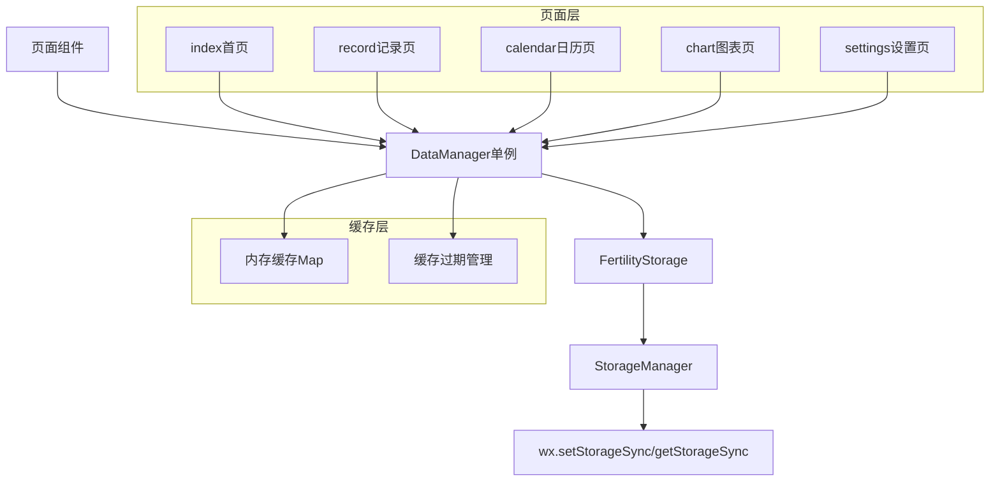
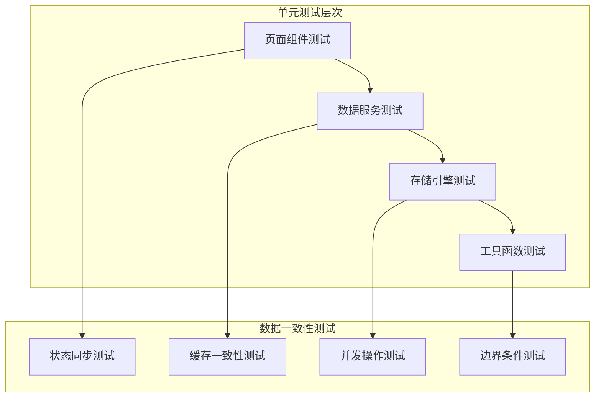
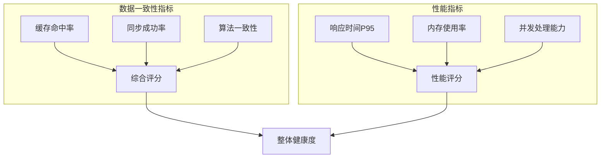

# 小程序页面数据统一性单元测试设计

## 概述

本文档针对生育助手小程序的页面间数据统一性问题，设计全面的单元测试方案。通过深入分析现有代码结构，识别潜在的数据一致性风险点，构建完整的测试覆盖体系。

## 技术栈与依赖

- **测试框架**: Jest + 微信小程序测试工具
- **核心模块**: DataManager、FertilityStorage、DateUtils
- **页面架构**: 微信小程序原生框架 + TypeScript
- **数据管理**: 单例模式 + 本地存储 + 内存缓存

## 数据流架构分析



## 数据统一性风险点识别

### 高风险区域

#### 1. 跨页面数据状态同步
- **风险**: 页面间数据更新后，其他页面未及时获取最新状态
- **影响页面**: index ↔ record ↔ calendar ↔ chart
- **数据类型**: 体温记录、月经记录、同房记录

#### 2. 缓存与存储不一致
- **风险**: 内存缓存与本地存储数据出现偏差
- **根本原因**: 缓存失效机制、并发操作、异常处理不当

#### 3. 周期计算一致性
- **风险**: 不同页面计算的周期信息存在差异
- **关键算法**: 周期开始日期、排卵期预测、易孕期计算

#### 4. 日期边界处理
- **风险**: 跨月、跨年、时区变化时的数据处理异常
- **具体场景**: 月末记录、闰年处理、夏令时调整

## 单元测试架构设计

### 测试分层策略



### 核心测试模块

#### 1. 页面数据同步测试 (PageDataSyncTest)

```javascript
// 测试页面间数据实时同步
describe('页面数据同步测试', () => {
  test('记录页保存后，首页状态立即更新', async () => {
    // 模拟记录页保存体温数据
    const temperatureRecord = {
      date: '2025-01-15',
      time: '07:30',
      temperature: 36.8,
      note: '测试记录'
    };
    
    // 验证首页获取最新数据
    // 验证日历页显示更新
    // 验证图表页数据刷新
  });
  
  test('设置页修改用户配置后，其他页面配置生效', async () => {
    // 测试周期长度修改
    // 测试黄体期长度修改
    // 测试单位设置修改
  });
});
```

#### 2. 缓存一致性测试 (CacheConsistencyTest)

```javascript
describe('缓存一致性测试', () => {
  test('缓存过期后重新加载存储数据', async () => {
    const dataManager = DataManager.getInstance();
    
    // 设置缓存数据
    // 模拟缓存过期
    // 验证重新从存储加载
    // 验证数据一致性
  });
  
  test('存储更新后缓存自动失效', async () => {
    // 直接修改存储数据
    // 验证缓存失效机制
    // 验证下次访问获取最新数据
  });
  
  test('并发操作下缓存状态正确', async () => {
    // 模拟多个页面同时操作
    // 验证缓存锁定机制
    // 验证数据完整性
  });
});
```

#### 3. 数据完整性测试 (DataIntegrityTest)

```javascript
describe('数据完整性测试', () => {
  test('记录删除后关联数据清理', async () => {
    // 删除某日记录
    // 验证周期统计更新
    // 验证图表数据刷新
    // 验证预测算法重算
  });
  
  test('周期边界数据处理', async () => {
    // 跨周期记录查询
    // 周期开始/结束日期修改
    // 验证数据归属正确性
  });
});
```

#### 4. 算法一致性测试 (AlgorithmConsistencyTest)

```javascript
describe('算法一致性测试', () => {
  test('排卵期预测算法在不同页面结果一致', async () => {
    const testData = generateTestTemperatureData();
    
    // 首页预测结果
    const indexPrediction = await IndexPage.getPrediction(testData);
    
    // 图表页预测结果  
    const chartPrediction = await ChartPage.getPrediction(testData);
    
    // 日历页预测结果
    const calendarPrediction = await CalendarPage.getPrediction(testData);
    
    expect(indexPrediction.ovulationDate).toBe(chartPrediction.ovulationDate);
    expect(chartPrediction.ovulationDate).toBe(calendarPrediction.ovulationDate);
  });
  
  test('易孕期计算在不同场景下保持一致', async () => {
    // 标准28天周期
    // 不规律周期
    // 数据不足场景
  });
});
```

## 边界条件测试扩展

### 现有测试覆盖分析
当前`boundary.test.js`已覆盖：
- 日期边界（闰年、月末、年末）
- 体温极值处理
- 空数据处理
- 算法稳定性

### 新增边界测试

#### 1. 数据量边界测试

```javascript
describe('数据量边界测试', () => {
  test('大量历史数据下的性能表现', async () => {
    // 生成2年历史数据
    const historicalData = generateLargeDataset(730);
    
    // 测试加载性能
    // 测试查询性能
    // 测试缓存效率
  });
  
  test('存储容量接近上限时的处理', async () => {
    // 模拟存储空间不足
    // 验证数据清理机制
    // 验证用户提醒
  });
});
```

#### 2. 网络异常边界测试

```javascript
describe('网络异常边界测试', () => {
  test('存储API调用失败时的降级处理', async () => {
    // 模拟wx.setStorageSync失败
    // 验证错误处理
    // 验证用户提示
    // 验证数据恢复
  });
});
```

## 测试数据管理

### Mock数据工厂

```javascript
class TestDataFactory {
  // 生成标准周期数据
  static generateStandardCycle(startDate, cycleLength = 28) {
    return {
      id: `cycle_${Date.now()}`,
      startDate,
      endDate: DateUtils.addDays(startDate, cycleLength - 1),
      length: cycleLength
    };
  }
  
  // 生成体温序列
  static generateTemperatureSequence(dateRange, pattern = 'normal') {
    // normal: 正常双相体温
    // anovulation: 无排卵周期
    // irregular: 不规律体温
  }
  
  // 生成月经记录
  static generateMenstrualRecord(date, padCount, color = 'red') {
    return {
      date,
      padCount,
      color,
      isStart: false,
      isEnd: false,
      note: ''
    };
  }
}
```

### 测试环境隔离

```javascript
describe('数据隔离测试环境', () => {
  beforeEach(async () => {
    // 清空所有存储数据
    await TestUtils.clearAllStorage();
    
    // 重置DataManager实例
    DataManager.resetInstance();
    
    // 设置测试数据
    await TestDataFactory.setupTestEnvironment();
  });
  
  afterEach(async () => {
    // 清理测试数据
    await TestUtils.cleanupTestData();
  });
});
```

## 并发操作测试

### 竞态条件测试

```javascript
describe('并发操作测试', () => {
  test('多页面同时保存记录', async () => {
    const promises = [
      recordPage.saveTemperatureRecord(record1),
      calendarPage.saveIntercourseRecord(record2),
      chartPage.updateCycleInfo(cycle1)
    ];
    
    const results = await Promise.all(promises);
    
    // 验证所有操作成功
    // 验证数据完整性
    // 验证无数据丢失
  });
  
  test('缓存读写并发冲突', async () => {
    // 模拟高频缓存操作
    // 验证数据竞态处理
    // 验证最终一致性
  });
});
```

## 回归测试套件

### 关键功能回归

```javascript
describe('数据一致性回归测试', () => {
  test('记录流程完整性', async () => {
    // 完整的用户操作流程
    // 跨页面数据流转
    // 端到端验证
  });
  
  test('周期计算回归', async () => {
    // 使用历史真实数据
    // 验证计算结果稳定性
    // 检查算法变更影响
  });
});
```

## 性能测试指标

### 响应时间基准

| 操作类型 | 目标响应时间 | 测试方法 |
|---------|-------------|----------|
| 页面数据加载 | < 200ms | 模拟loadPageData() |
| 单条记录保存 | < 100ms | 模拟saveRecord() |
| 缓存查询 | < 50ms | 模拟getCache() |
| 跨页面同步 | < 300ms | 模拟页面切换 |

### 内存使用监控

```javascript
describe('内存使用测试', () => {
  test('长时间运行无内存泄漏', async () => {
    const initialMemory = getMemoryUsage();
    
    // 执行1000次操作
    for (let i = 0; i < 1000; i++) {
      await performDataOperation();
    }
    
    const finalMemory = getMemoryUsage();
    expect(finalMemory - initialMemory).toBeLessThan(MEMORY_THRESHOLD);
  });
});
```

## 测试执行策略

### 分级测试


### 自动化测试配置

```javascript
// jest.config.js 扩展配置
module.exports = {
  testEnvironment: 'miniprogram',
  setupFilesAfterEnv: ['<rootDir>/tests/setup.js'],
  testMatch: [
    '**/tests/consistency/**/*.test.js',
    '**/tests/data-sync/**/*.test.js'
  ],
  collectCoverageFrom: [
    'utils/dataManager.ts',
    'utils/storage.js',
    'pages/**/**.js'
  ],
  coverageThreshold: {
    global: {
      branches: 80,
      functions: 85,
      lines: 85,
      statements: 85
    }
  }
};
```

## 测试报告与监控

### 测试指标看板



### 持续集成集成

```yaml
# 测试流水线配置
test_data_consistency:
  stage: test
  script:
    - npm run test:consistency
    - npm run test:data-sync  
    - npm run test:performance
  artifacts:
    reports:
      junit: test-results.xml
      coverage: coverage/
```

## 风险缓解措施

### 数据恢复机制

```javascript
class DataRecoveryManager {
  // 数据备份
  static async createBackup(reason) {
    const backup = {
      timestamp: Date.now(),
      reason,
      data: await DataManager.getInstance().exportAllData()
    };
    
    await FertilityStorage.saveBackup(backup);
  }
  
  // 数据恢复
  static async restoreFromBackup(backupId) {
    const backup = await FertilityStorage.getBackup(backupId);
    await DataManager.getInstance().importAllData(backup.data);
  }
}
```

### 监控告警

```javascript
class DataConsistencyMonitor {
  static async checkConsistency() {
    const issues = [];
    
    // 检查缓存一致性
    const cacheIssues = await this.checkCacheConsistency();
    issues.push(...cacheIssues);
    
    // 检查算法一致性
    const algorithmIssues = await this.checkAlgorithmConsistency();
    issues.push(...algorithmIssues);
    
    if (issues.length > 0) {
      await this.reportIssues(issues);
    }
    
    return issues;
  }
}
```